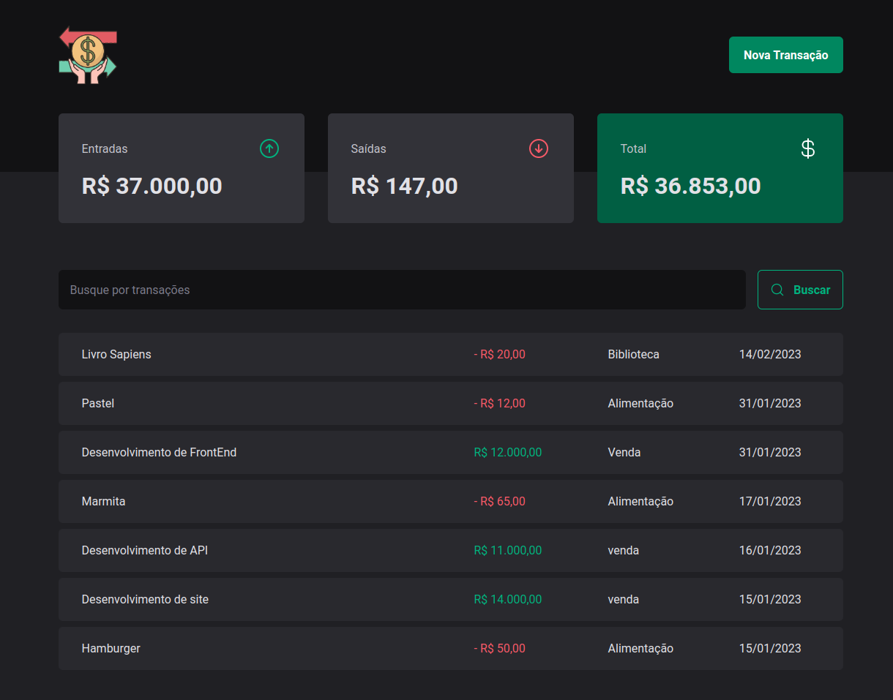
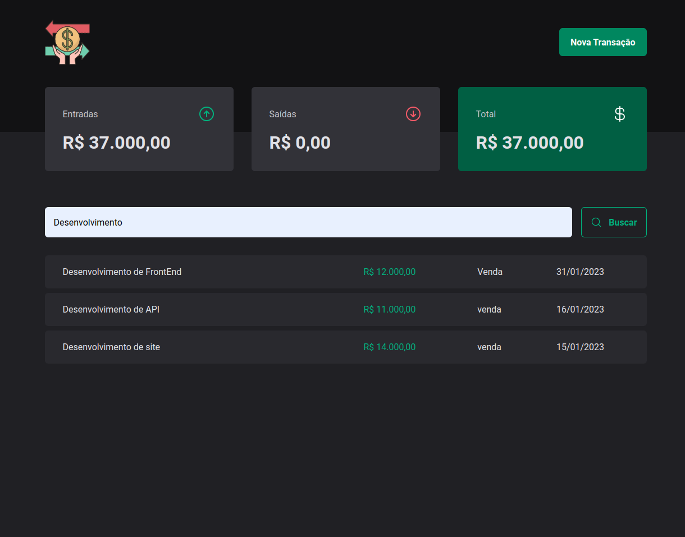
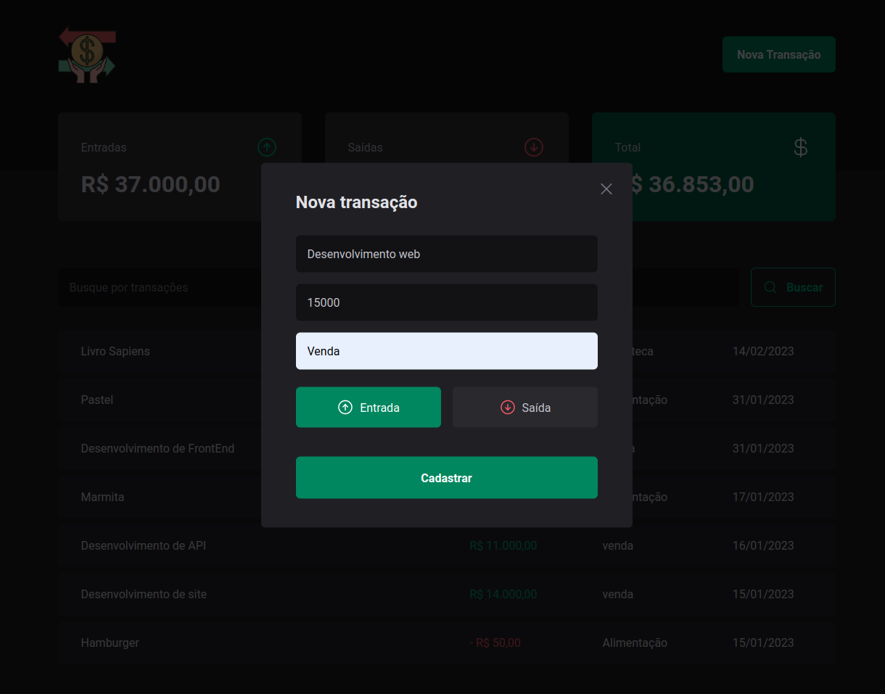
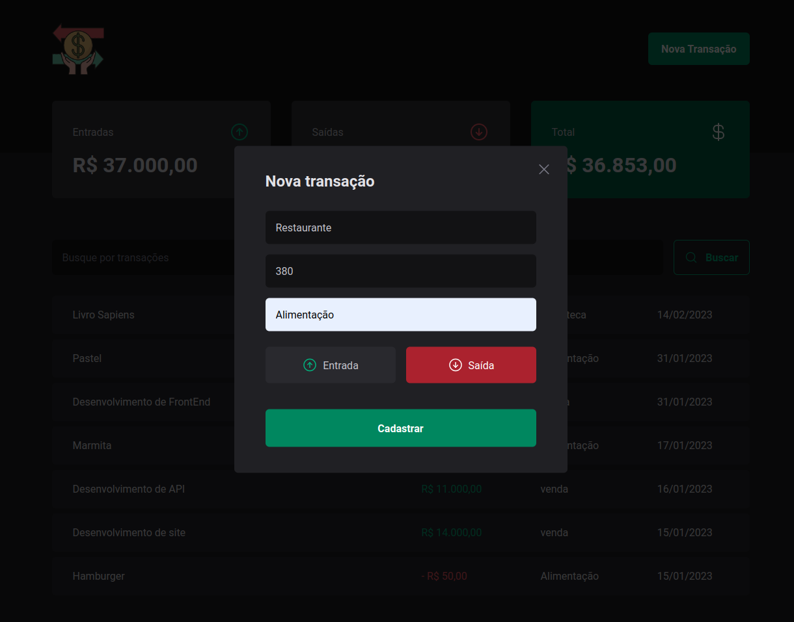

# DT-Money 

## Descrição do Projeto
 O DT-Money é um controle financeiro com entrada e saída.
 A gente consegue cadastrar novas entradas, saída, fazer busca e filtros. Ele foi desenvolvido em React e utilizando Typescript.
 Foi aplicada a biblioteca Json-Server para simular um back-end. 

 
 

#
#### Acesse o app : <a href="https://dt-money-orcin.vercel.app/">DT-Money</a>
#

